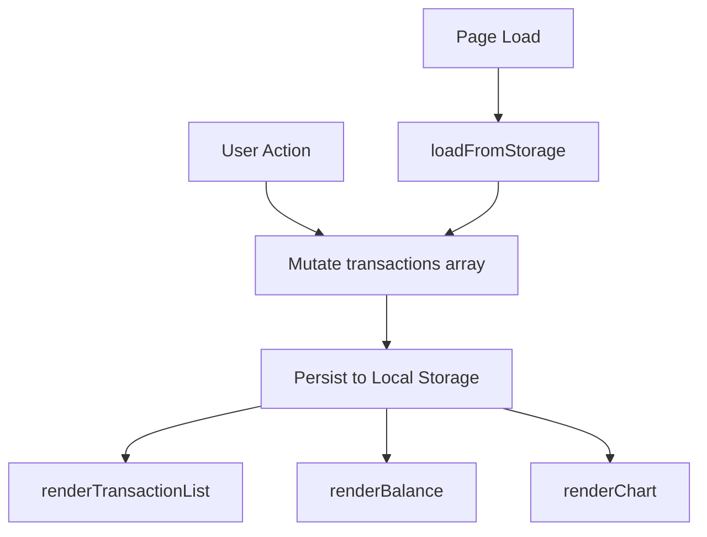

# Design Document: Expense & Budget Visualizer

## Overview

The Expense & Budget Visualizer is a single-page, client-side web application built with plain HTML, CSS, and Vanilla JavaScript. It lets users record expense transactions, view a running total balance, browse a scrollable transaction history, and see a live pie chart of spending by category — all persisted in the browser's Local Storage with no backend required.

The entire application logic lives in one JavaScript file (`js/app.js`), organized as a collection of pure functions and a thin event-wiring layer. Chart.js is loaded via CDN and used exclusively for the pie chart.

---

## Architecture

The app follows a simple **data → render** cycle. Every user action (add, delete, load) mutates the in-memory `transactions` array, persists it to Local Storage, then calls the render functions to update the DOM and chart.



### Module Structure inside `js/app.js`

The single JS file is divided into logical sections using comment headers:

```
// ── STATE ──────────────────────────────────────────────
// ── STORAGE ────────────────────────────────────────────
// ── VALIDATION ─────────────────────────────────────────
// ── TRANSACTIONS ───────────────────────────────────────
// ── RENDER ─────────────────────────────────────────────
// ── CHART ──────────────────────────────────────────────
// ── EVENT WIRING ───────────────────────────────────────
// ── INIT ───────────────────────────────────────────────
```

---

## Data Model

### Transaction Object

```javascript
/**
 * @typedef {Object} Transaction
 * @property {string} id        - Unique identifier (crypto.randomUUID or Date.now().toString())
 * @property {string} name      - Item name (non-empty string)
 * @property {number} amount    - Positive number (e.g. 25000)
 * @property {string} category  - One of: "Food" | "Transport" | "Fun"
 */
```

### Local Storage Schema

```javascript
// Key used in localStorage
const STORAGE_KEY = "expense_transactions";

// Value stored: JSON-serialized array of Transaction objects
// Example:
// localStorage.getItem("expense_transactions")
// → '[{"id":"1","name":"Lunch","amount":25000,"category":"Food"}]'
```

**Invariants:**
- `amount` is always a finite positive number
- `category` is always one of the three valid values
- `id` is always a non-empty unique string
- The stored value is always a valid JSON array (or the key is absent)

---

## Component Breakdown

### 1. Input Form (`#expense-form`)

Renders inside `index.html`. Controlled entirely by event listeners in `app.js`.

| Element | Type | ID / Name |
|---|---|---|
| Item Name field | `<input type="text">` | `#input-name` |
| Amount field | `<input type="number">` | `#input-amount` |
| Category dropdown | `<select>` | `#input-category` |
| Submit button | `<button type="submit">` | — |
| Error message area | `<p>` | `#form-error` |

**Behavior:**
- On submit: validate → create transaction → persist → render → reset form
- On validation failure: show error in `#form-error`, do not reset

### 2. Balance Display (`#balance-display`)

A single `<span>` or `<p>` element that shows the computed sum of all transaction amounts.

```javascript
// Rendered by:
function renderBalance(transactions) {
  const total = transactions.reduce((sum, t) => sum + t.amount, 0);
  document.getElementById("balance-display").textContent =
    formatCurrency(total);
}
```

### 3. Transaction List (`#transaction-list`)

A `<ul>` element. Each transaction renders as an `<li>` with name, amount, category, and a delete button.

```javascript
// Each list item structure:
// <li data-id="<id>">
//   <span class="tx-name">Lunch</span>
//   <span class="tx-amount">Rp 25.000</span>
//   <span class="tx-category">Food</span>
//   <button class="btn-delete" data-id="<id>">×</button>
// </li>
```

When empty, the list shows a placeholder `<li class="empty-state">No expenses recorded yet.</li>`.

### 4. Pie Chart (`#expense-chart`)

A `<canvas id="expense-chart">` element. Chart.js renders into this canvas. The chart instance is stored in a module-level variable so it can be updated (not recreated) on each change.

---

## UI Layout

```
┌─────────────────────────────────────────────┐
│  💰 Expense & Budget Visualizer             │
│  Total Balance: Rp 125.000                  │
├──────────────────┬──────────────────────────┤
│  Add Expense     │   Spending by Category   │
│  ─────────────   │   ┌──────────────────┐   │
│  Item Name: [  ] │   │   [Pie Chart]    │   │
│  Amount:    [  ] │   │                  │   │
│  Category:  [▼] │   └──────────────────┘   │
│  [Add Expense]   │                          │
├──────────────────┴──────────────────────────┤
│  Transaction History                        │
│  ┌─────────────────────────────────────┐    │
│  │ Lunch          Rp 25.000  Food  [×] │    │
│  │ Bus ticket     Rp 5.000   Trans [×] │    │
│  │ ...                                 │    │
│  └─────────────────────────────────────┘    │
└─────────────────────────────────────────────┘
```

- **Top bar**: App title + total balance
- **Middle row** (two columns on desktop, stacked on mobile):
  - Left: Input form
  - Right: Pie chart
- **Bottom**: Scrollable transaction list (max-height with `overflow-y: auto`)
- Responsive: columns collapse to single column below ~600px via CSS media query

---

## Key Algorithms

### Add Transaction

```javascript
function addTransaction(name, amount, category) {
  const transaction = {
    id: crypto.randomUUID ? crypto.randomUUID() : Date.now().toString(),
    name: name.trim(),
    amount: parseFloat(amount),
    category,
  };
  transactions.push(transaction);
  saveToStorage(transactions);
  renderAll();
}
```

**Preconditions:**
- `name` is a non-empty string after trimming
- `amount` is a finite positive number
- `category` is one of "Food", "Transport", "Fun"

**Postconditions:**
- `transactions` array length increases by 1
- New transaction is persisted to Local Storage
- Balance, list, and chart are updated

### Delete Transaction

```javascript
function deleteTransaction(id) {
  transactions = transactions.filter((t) => t.id !== id);
  saveToStorage(transactions);
  renderAll();
}
```

**Preconditions:**
- `id` matches an existing transaction's `id`

**Postconditions:**
- `transactions` array length decreases by 1
- Transaction is removed from Local Storage
- Balance, list, and chart are updated

### Load from Storage

```javascript
function loadFromStorage() {
  try {
    const raw = localStorage.getItem(STORAGE_KEY);
    if (!raw) return [];
    const parsed = JSON.parse(raw);
    if (!Array.isArray(parsed)) throw new Error("Malformed data");
    return parsed;
  } catch (e) {
    showStorageWarning();
    return [];
  }
}
```

**Preconditions:** None (called at app init)

**Postconditions:**
- Returns a valid array of Transaction objects (possibly empty)
- If Local Storage is unavailable or data is malformed, returns `[]` and shows a warning

### Validate Form Input

```javascript
function validateForm(name, amount) {
  const errors = [];
  if (!name || name.trim() === "") errors.push("Item Name is required.");
  if (!amount || amount.trim() === "") errors.push("Amount is required.");
  else if (isNaN(parseFloat(amount)) || parseFloat(amount) <= 0)
    errors.push("Amount must be a positive number.");
  return errors; // empty array = valid
}
```

**Postconditions:**
- Returns an empty array if all inputs are valid
- Returns one or more descriptive error strings if invalid

### Update Chart

```javascript
function updateChart(transactions) {
  const totals = { Food: 0, Transport: 0, Fun: 0 };
  transactions.forEach((t) => (totals[t.category] += t.amount));

  const allZero = Object.values(totals).every((v) => v === 0);

  if (allZero) {
    // Show empty/neutral state
    chartInstance.data.datasets[0].data = [1, 1, 1];
    chartInstance.data.datasets[0].backgroundColor = ["#e0e0e0", "#e0e0e0", "#e0e0e0"];
  } else {
    chartInstance.data.datasets[0].data = [totals.Food, totals.Transport, totals.Fun];
    chartInstance.data.datasets[0].backgroundColor = ["#FF6384", "#36A2EB", "#FFCE56"];
  }
  chartInstance.update();
}
```

**Preconditions:** `chartInstance` is initialized

**Postconditions:**
- Chart reflects current category totals
- Empty state shows a neutral greyed-out chart when no transactions exist

---

## Chart.js Integration

### Loading via CDN

```html
<!-- In index.html, before js/app.js -->
<script src="https://cdn.jsdelivr.net/npm/chart.js"></script>
<script src="js/app.js"></script>
```

### Initialization

```javascript
let chartInstance = null;

function initChart() {
  const ctx = document.getElementById("expense-chart").getContext("2d");
  chartInstance = new Chart(ctx, {
    type: "pie",
    data: {
      labels: ["Food", "Transport", "Fun"],
      datasets: [
        {
          data: [1, 1, 1], // neutral empty state
          backgroundColor: ["#e0e0e0", "#e0e0e0", "#e0e0e0"],
          borderWidth: 1,
        },
      ],
    },
    options: {
      responsive: true,
      plugins: {
        legend: { position: "bottom" },
        tooltip: { enabled: true },
      },
    },
  });
}
```

### Update Strategy

The chart instance is **mutated in place** (not destroyed and recreated) on every add/delete. This avoids flickering and keeps the animation smooth. `chartInstance.update()` triggers Chart.js's built-in transition animation.

---

## Error Handling

| Scenario | Handling |
|---|---|
| Empty form fields | Inline error in `#form-error`, form not submitted |
| Non-positive amount | Inline error in `#form-error`, form not submitted |
| Local Storage unavailable | `try/catch` in `loadFromStorage`, show warning banner, init with empty array |
| Malformed JSON in storage | Same as above — caught by `JSON.parse` error |
| Chart.js CDN fails to load | Chart canvas stays blank; rest of app functions normally |

---

## Render Cycle

All three render functions are called together via a single `renderAll()` helper to keep the UI consistent:

```javascript
function renderAll() {
  renderTransactionList(transactions);
  renderBalance(transactions);
  updateChart(transactions);
}
```

This ensures the balance, list, and chart are always in sync after any state change.

---

## Correctness Properties

*A property is a characteristic or behavior that should hold true across all valid executions of a system — essentially, a formal statement about what the system should do. Properties serve as the bridge between human-readable specifications and machine-verifiable correctness guarantees.*

### Property 1: Transaction addition round-trip

For any valid transaction (non-empty name, positive amount, valid category), after it is added, reading from Local Storage and parsing the result should return an array that contains a transaction with the same name, amount, and category.

**Validates: Requirements 5.1, 5.3**

### Property 2: Balance equals sum of amounts

For any array of transactions, the displayed balance should always equal the arithmetic sum of all transaction amounts. This holds after every add and every delete.

**Validates: Requirements 3.1, 3.2, 3.3, 3.4**

### Property 3: Whitespace and empty names are rejected

For any string composed entirely of whitespace characters (or the empty string) used as an item name, the validator should reject the submission and the transaction list should remain unchanged.

**Validates: Requirements 1.3**

### Property 4: Non-positive amounts are rejected

For any numeric value that is zero or negative, or any non-numeric string used as an amount, the validator should reject the submission and the transaction list should remain unchanged.

**Validates: Requirements 1.4**

### Property 5: Delete removes exactly one transaction

For any transaction list and any transaction ID present in that list, deleting by that ID should produce a list that is exactly one element shorter and contains no transaction with that ID.

**Validates: Requirements 2.3, 5.2**

### Property 6: Chart category totals match transaction data

For any array of transactions, the data values passed to the chart for each category (Food, Transport, Fun) should equal the sum of amounts of all transactions in that category.

**Validates: Requirements 4.1, 4.2, 4.3**

### Property 7: Storage round-trip preserves transaction data

For any valid array of Transaction objects, serializing to Local Storage and then deserializing should produce an array of objects that are deeply equal to the originals.

**Validates: Requirements 5.1, 5.2, 5.3**
